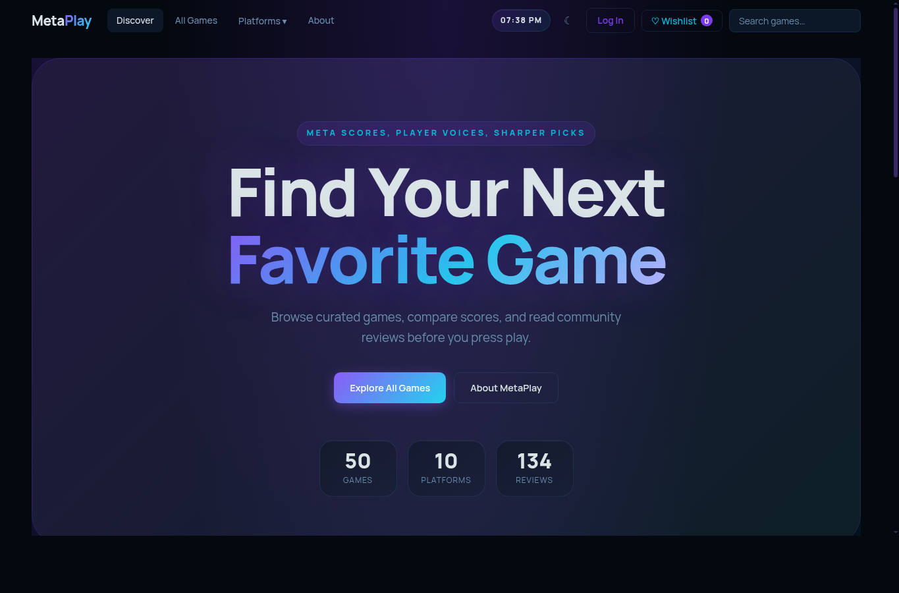
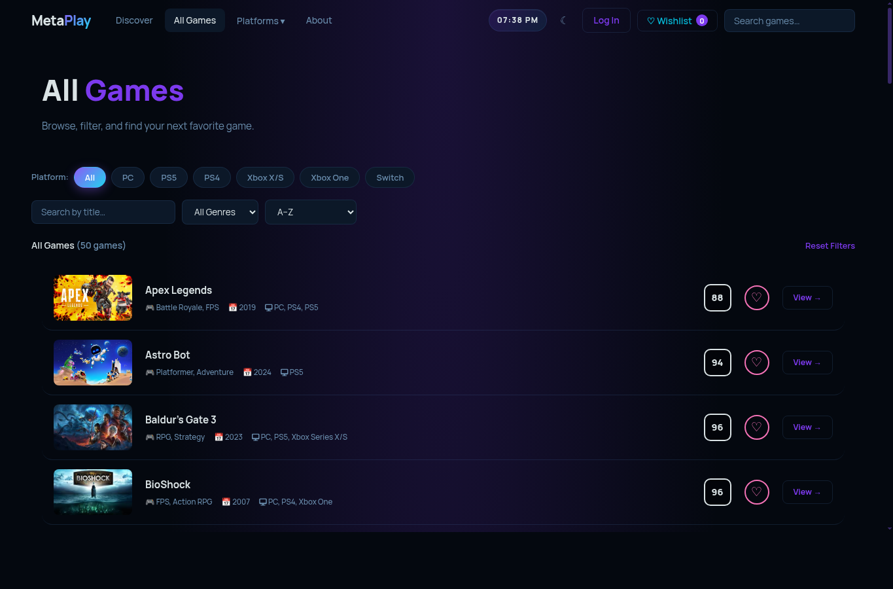
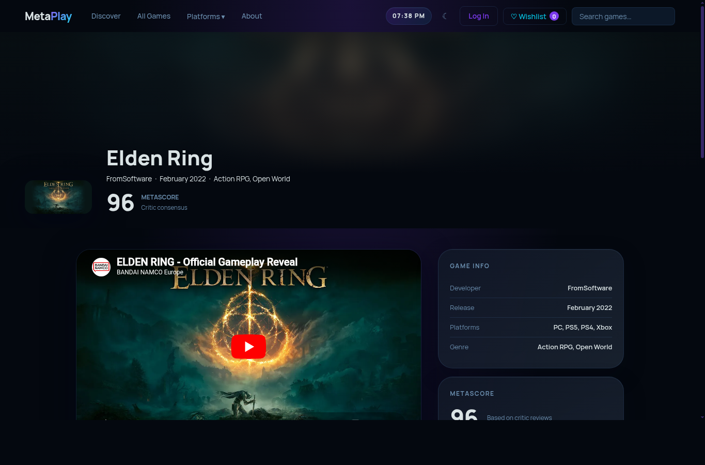
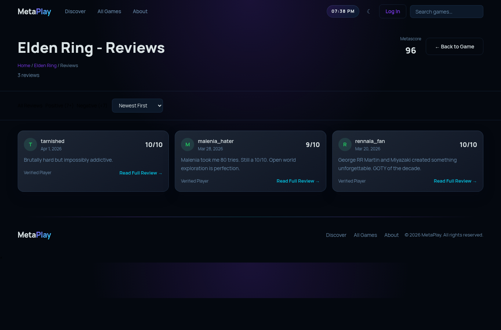
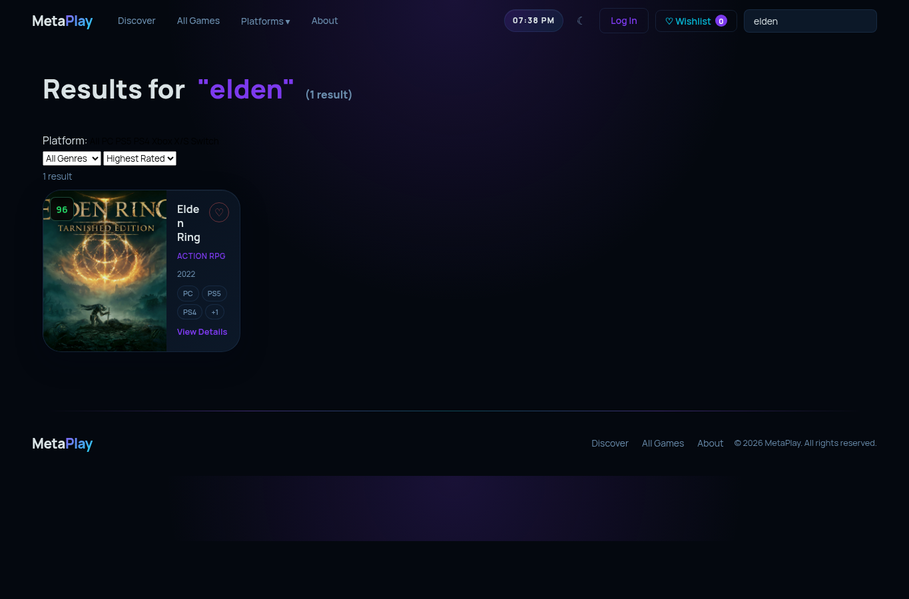
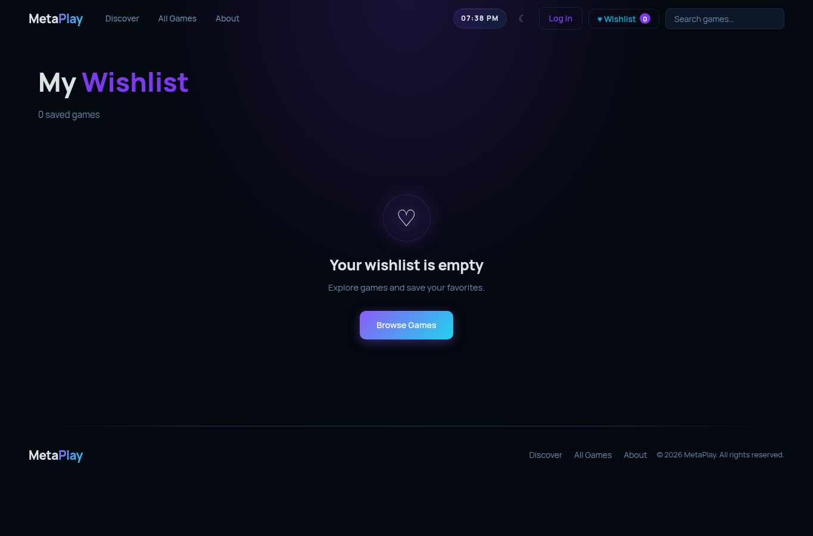
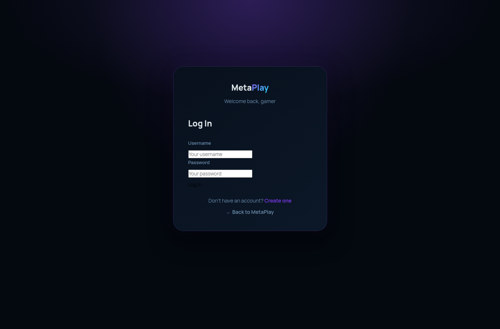
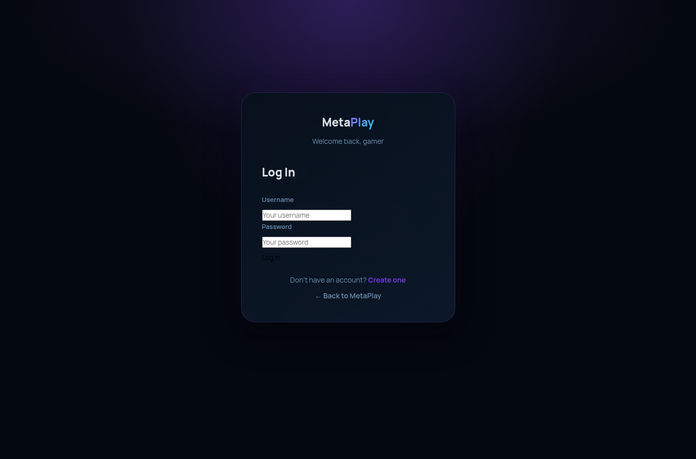
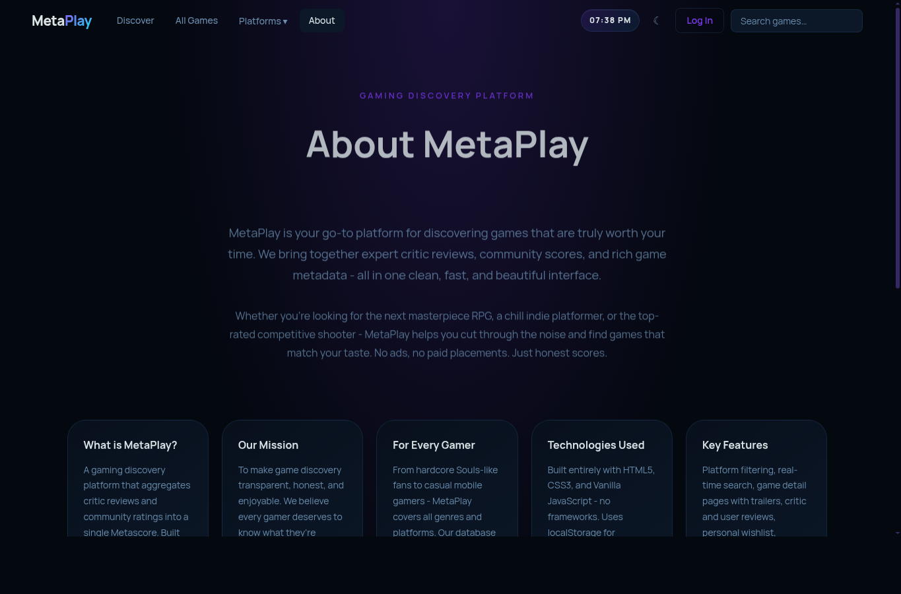

# Dokumentasi website MetaPlay

Nama proyek: MetaPlay  
Jenis proyek: website katalog dan review game  
Bahasa: HTML, CSS, JavaScript  
Penyimpanan data: localStorage browser

## Gambaran singkat

MetaPlay adalah website sederhana untuk melihat daftar game, membaca review, memberi review, dan menyimpan game ke wishlist. Website ini tidak memakai backend. Semua data login, review user, dan wishlist disimpan di browser lewat localStorage.

Desainnya sekarang sengaja dibuat lebih sederhana. Efek yang terlalu ramai seperti sparkle, bintang animasi, dan glow yang bergerak sudah dikurangi supaya kode CSS lebih mudah dibaca.

## Struktur file utama

- `index.html` untuk halaman utama.
- `games.html` untuk daftar semua game.
- `game.html` untuk detail satu game.
- `reviews.html` untuk daftar review satu game.
- `search.html` untuk hasil pencarian.
- `wishlist.html` untuk game yang disimpan.
- `login.html` dan `register.html` untuk akun user.
- `profile.html` untuk profil user.
- `about.html` untuk penjelasan proyek.

CSS utama ada di `css/style.css`. CSS per halaman ada di folder `css/pages/`. JavaScript dipisah ke folder `js/core/`, `js/components/`, `js/features/`, dan `js/pages/`.

## Cara mencari bagian kode

Di VS Code, tekan `Ctrl + F`, lalu cari kata ini:

- `navbar` untuk menu atas.
- `hero section` untuk bagian pembuka halaman utama.
- `review page` atau `reviews page` untuk halaman review.
- `game card` untuk kartu game.
- `wishlist` untuk fitur simpan game.
- `search page` untuk halaman pencarian.
- `profile page` untuk halaman profil.
- `game detail page` untuk halaman detail game.
- `all games page` untuk halaman semua game.

Komentar di kode memang dibuat seperti itu supaya bagian penting cepat ditemukan.

## Halaman utama

Halaman utama adalah pintu masuk website. Bagian atas berisi navbar, search, tombol tema, wishlist, dan login atau profil.

Fitur di halaman ini:

- Hero section untuk memperkenalkan website.
- Tombol menuju daftar semua game.
- Statistik jumlah game, platform, dan review.
- Bagian Trending Now.
- Bagian Game of the Week.
- Bagian Top Rated.

File yang paling sering dibuka untuk halaman ini:

- `index.html`
- `css/pages/home.css`
- `js/pages/home.js`

## Halaman semua game

Halaman ini menampilkan semua game dalam bentuk list. User bisa menyaring game berdasarkan platform, genre, urutan, dan kata pencarian.

Fitur di halaman ini:

- Filter platform.
- Filter genre.
- Sort A-Z, score, atau tahun.
- Search kecil di halaman.
- Tombol reset filter.
- Kartu game berbentuk list.

File penting:

- `games.html`
- `css/pages/games.css`
- `js/pages/games.js`
- `js/features/filters.js`

## Halaman detail game

Halaman ini dipakai untuk melihat satu game secara lengkap. Game dipilih dari query URL, contohnya `game.html?id=elden-ring`.

Fitur di halaman ini:

- Banner detail game.
- Trailer game.
- Info genre, platform, developer, dan tahun.
- Metascore.
- Review dari critic.
- Review dari user.
- Form tulis review.
- Tombol wishlist.
- Rekomendasi game lain.

File penting:

- `game.html`
- `css/pages/game.css`
- `js/pages/game.js`
- `js/features/reviews.js`
- `js/features/wishlist.js`

## Halaman review

Halaman ini menampilkan semua review dari satu game. Halaman ini cocok kalau user ingin membaca komentar lebih banyak tanpa membuka detail game terus.

Fitur di halaman ini:

- Header nama game.
- Jumlah review.
- Sort review.
- Kartu review.
- Panel untuk membaca review lengkap.

File penting:

- `reviews.html`
- `css/pages/reviews.css`
- `js/pages/reviewsPage.js`
- `js/components/reviewViewer.js`

## Halaman pencarian

Halaman pencarian muncul saat user mencari game dari navbar. Hasil pencarian tetap bisa difilter lagi.

Fitur di halaman ini:

- Menampilkan kata yang dicari.
- Menampilkan jumlah hasil.
- Filter platform.
- Filter genre.
- Sort hasil.
- Kartu game hasil pencarian.

File penting:

- `search.html`
- `css/pages/search.css`
- `js/pages/search.js`

## Halaman wishlist

Wishlist menyimpan game yang disukai user. Data wishlist disimpan di localStorage, jadi masih ada selama browser belum dibersihkan.

Fitur di halaman ini:

- Menampilkan daftar game yang disimpan.
- Tombol remove untuk menghapus game dari wishlist.
- Empty state kalau belum ada game.
- Jumlah wishlist di navbar ikut berubah.

File penting:

- `wishlist.html`
- `css/pages/wishlist.css`
- `js/pages/wishlistPage.js`
- `js/features/wishlist.js`

## Halaman login

Halaman login dipakai untuk masuk ke akun yang sudah dibuat. Sistem login ini sederhana dan hanya untuk proyek belajar, bukan untuk website produksi.

Fitur di halaman ini:

- Input username.
- Input password.
- Validasi login.
- Redirect ke profile kalau berhasil.
- Redirect otomatis kalau user sudah login.

File penting:

- `login.html`
- `css/pages/auth.css`
- `js/pages/login.js`
- `js/core/auth.js`

## Halaman register

Halaman register dipakai untuk membuat akun baru. User bisa menambahkan foto profil, tapi bagian ini opsional.

Fitur di halaman ini:

- Input username.
- Input password.
- Konfirmasi password.
- Upload foto profil.
- Preview foto sebelum daftar.
- Validasi username dan password.

File penting:

- `register.html`
- `css/pages/auth.css`
- `js/pages/register.js`
- `js/core/auth.js`

## Halaman profil

Halaman profil menampilkan data user yang sedang login. Dari sini user bisa melihat review yang pernah dibuat dan mengubah username atau foto profil.

Fitur di halaman ini:

- Foto profil.
- Username.
- Tanggal akun dibuat.
- Jumlah review.
- Jumlah wishlist.
- Daftar review milik user.
- Upload foto profil.
- Edit username.
- Hapus review sendiri.

File penting:

- `profile.html`
- `css/pages/profile.css`
- `js/pages/profile.js`
- `js/core/auth.js`

## Halaman about

Halaman about menjelaskan tujuan proyek MetaPlay. Isinya lebih ke informasi proyek dan pembuat.

Fitur di halaman ini:

- Penjelasan singkat proyek.
- Kartu fitur.
- Statistik game.
- Bagian academic context.
- Profil pembuat.

File penting:

- `about.html`
- `css/pages/about.css`
- `js/pages/about.js`

## Fitur global

### Navbar

Navbar muncul di semua halaman. Isinya logo, menu halaman, dropdown platform, search, jam, tombol tema, wishlist, dan login atau profil.

File utama:

- `js/components/navbar.js`
- `css/style.css`

### Theme toggle

Website punya tema gelap dan terang. Tombol tema ada di navbar. Pilihan tema disimpan di localStorage.

File utama:

- `js/core/theme.js`
- `css/style.css`

### Search

Search di navbar memberi saran game saat user mengetik. Kalau user menekan hasil pencarian, website membuka detail game atau halaman search.

File utama:

- `js/components/navbar.js`
- `js/pages/search.js`

### Review

User bisa menulis review di halaman detail game. Review user disimpan di localStorage dan bisa dibaca lagi di halaman review atau profil.

File utama:

- `js/features/reviews.js`
- `js/pages/game.js`
- `js/pages/reviewsPage.js`

### Wishlist

Wishlist menyimpan id game ke localStorage. Game bisa ditambahkan dari kartu game atau halaman detail game.

File utama:

- `js/features/wishlist.js`
- `js/components/gameCard.js`
- `js/pages/wishlistPage.js`

### Auth sederhana

Login dan register dibuat untuk simulasi akun. Karena datanya di localStorage, fitur ini cocok untuk tugas praktikum, bukan untuk website asli yang dipakai publik.

File utama:

- `js/core/auth.js`
- `js/pages/login.js`
- `js/pages/register.js`
- `js/pages/profile.js`

## Catatan untuk pemula

Kalau ingin mengubah tampilan halaman tertentu, buka file CSS di `css/pages/`. Misalnya mau mengubah halaman review, buka `css/pages/reviews.css`.

Kalau ingin mengubah fungsi halaman tertentu, buka file JS di `js/pages/`. Misalnya mau mengubah halaman detail game, buka `js/pages/game.js`.

Kalau ingin mengubah data game, buka `js/core/data.js`. Tambahkan data baru ke `fullGameData` dengan format yang sama seperti game lain.

Kalau bingung mulai dari mana, pakai `Ctrl + F` lalu cari nama fitur. Komentar di kode sudah diberi kata kunci supaya gampang dilacak.
